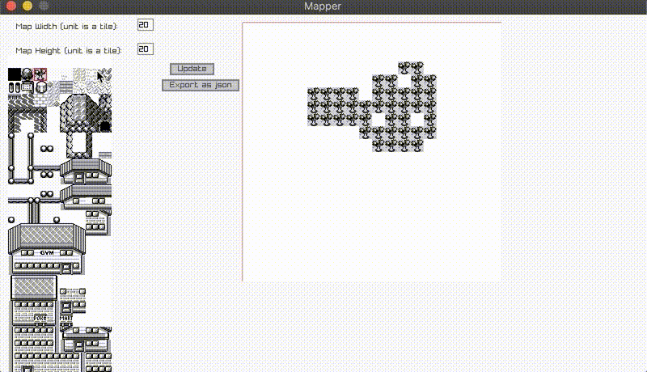

Ttme is Tiny Tile Map Editor (think [Tiled](https://www.mapeditor.org/) but with way less features). It is written in [Golang](https://golang.org/)
using [those bindings](https://github.com/gen2brain/raylib-go) to the awesome [raygui/raylib](https://www.raylib.com/).

I started this project because I wanted to learn Go and try to build a cross-platform GUI application without using big frameworks.

## Builds

### Run

Run the project

`make`

### Build

Build for Windows and Darwin.
Bin file are under ./build.
Zipfile with all builds is under ./packed_build.

`make fbuild`

### Clean

Clean build folders

`make fclean`

## Current Feature

- Chose map size
- Draw map
- JSON export
- Use own tileset (tile size has to be specified at map creation)



The exported json file was:

```json
# Real output is a one liner but I prettyfied it.
{
   "Width":10,
   "Height":10,
   "Board":[
      [0,0,0,0,0,0,0,0,0,0],
      [0,0,0,0,0,0,0,0,0,0],
      [0,0,0,0,0,0,0,0,0,0],
      [0,0,0,0,0,0,0,0,0,0],
      [0,0,0,0,0,0,0,0,0,0],
      [0,0,0,0,0,10,10,10,10,15],
      [0,0,0,0,0,10,10,10,10,15],
      [0,0,13,13,13,10,13,13,10,10],
      [0,0,13,19,13,19,13,13,13,13],
      [0,0,13,13,13,13,13,13,13,13]
   ]
}
```

## Future

Since I don't use this project at the moment, it'll evolve but slowly while I have fun coding it.

### Little feature

- Export to YML
- Reload existing map

### Big feature

#### Make board viewer scrollable

Be able to scroll on the board viewer woul be awesome to work on big maps

#### Build tileset alongside your map

I would like to let you use multiple images (tile or tileset) and build your tilset at
the runtime with part of images you use while building your map

#### Build custom tiles

I mean you should be able to not only get the tile position in the tileset but get some useful infomations too
like knowing if the tile is solid or is an object, ...
