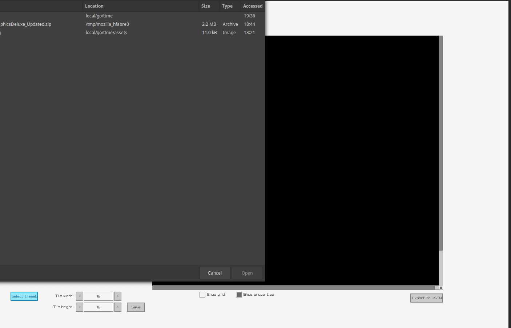

Ttme is Tiny Tile Map Editor (think [Tiled](https://www.mapeditor.org/) but with way less features). It is written in [Golang](https://golang.org/)
using [those bindings](https://github.com/lachee/raylib-goplus) to the awesome [raygui/raylib](https://www.raylib.com/).

I started this project because I wanted to learn Go and try to build a cross-platform GUI application without using big frameworks.

## Builds

### Run

Run the project

`make`

### Build

Build for Windows, Darwin and Linux.
Bin file are under ./build.
Zipfile with all builds is under ./packed_build.

`make fbuild`

### Clean

Clean build folders

`make fclean`

## Current Feature

- Define map size
- Use your own tileset (with the tile size you want)
- Ability to add (custom) properties to your tiles (blocking property exists by default)
- Export to json
- Show/Hide grid
- Show/Hide properties
- Reload existing map through arguments (`ttme mymap.json`)

## Known bugs or limitations

- Open a File dialog at startup (It's a workaround [this bug](https://github.com/sqweek/dialog/issues/51))
- Does not support layers (may be added in the future)
- Does not show well on high DPI screens (at least on my Macbook)

## Demo



The exported json file can be found under `assets/example.json`, but here is a template:

```json
{
   "width": Int,
   "height": Int,
   "tileset": {
      "tileWidth": Int,
      "tileHeight": Int,
      "imagePath": String
   },
   "tiles": [
    {
       "index": Int (-1 for empty tiles),
       "properties": [{"name":  String, "value":  String, "color": {"R": Int,"G": Int,"B": Int,"A": Int}}] (can be null)
    }
  ]
}
```

## Future

Since I don't use this project at the moment, it will evolve but slowly while I have fun coding it.
